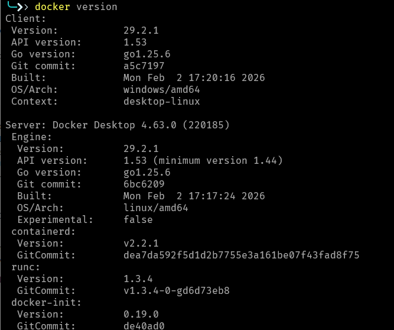
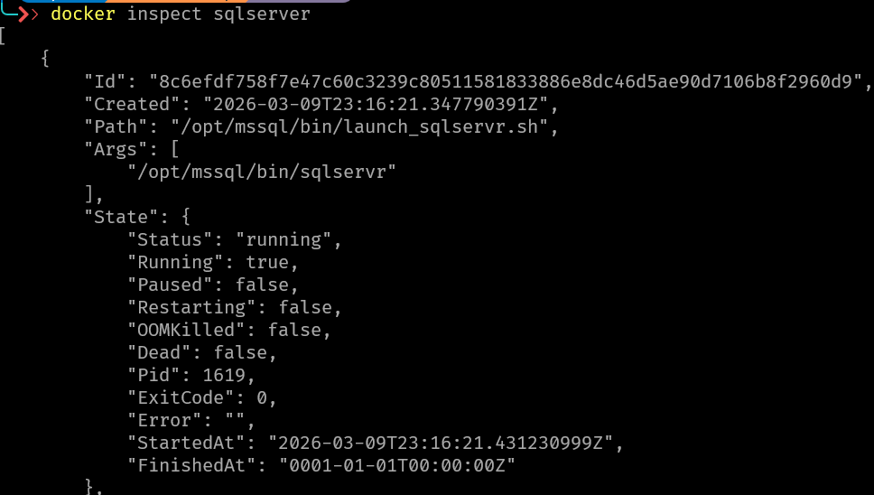
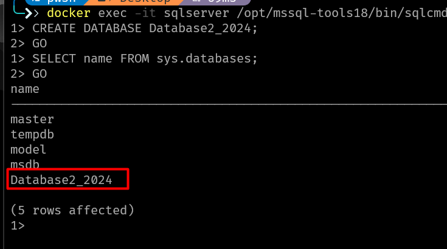
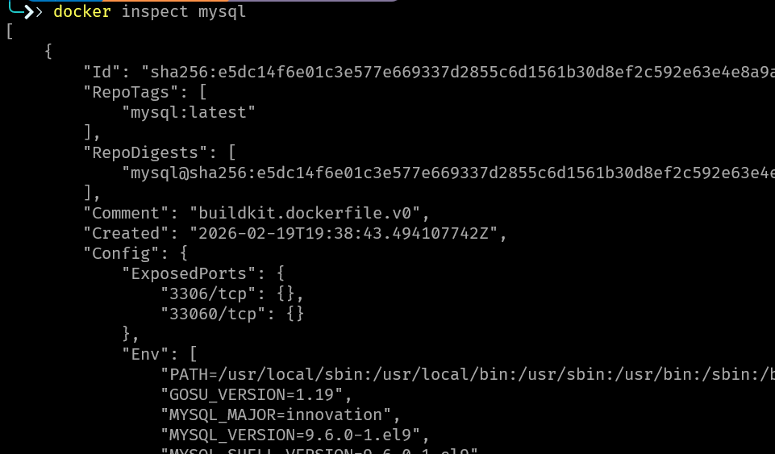
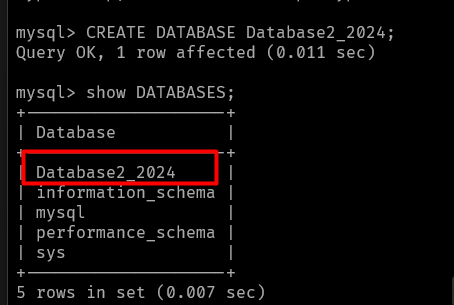

## Laboratario 1

Brayan Stiven Chaparro Cataño


### Ejercicio 1

1. Instalación y configuración

* Instalación de Docker en Windows 



* Instalación de SQL Server usando Docker se monta el container y se ejecuta para la creacion de la base de datos.

```ps1
docker pull mcr.microsoft.com/mssql/server:2025-latest
```




Ingresar al contenedor;

```ps1
 docker exec -it sqlserver /opt/mssql-tools18/bin/sqlcmd -S localhost -U sa -P "password!" -C
```

Creacion de la base de datos

```sql
CREATE DATABASE Database2_2024;
GO
SELECT name FROM sys.databases;
GO

```


* Instalacion de Mysql 



```ps1
docker run --name mysql-container -e MYSQL_ROOT_PASSWORD=pasword -p 3306:3306 -d mysql:latest
```


Ingresar al contenedor 

```ps1
docker exec -it mysql-container mysql -u root -p
```

Creación de base de datos 

```sql 
CREATE DATABASE Database2_2024;

SHOW DATABASES;

```

#

### Ejercicio 2

1. Realiza diagrama entidad relacion segun los enunciados 


#

### Ejercicio 3


1. Insertar Medico, Paciente y Cita

```sql
START TRANSACTION;

INSERT INTO Medico (nombre_completo, especialidad, num_colgeiado) 
VALUES ('Dr. Roberto Gomez', 'Cardiología', 'COL-9988');


INSERT INTO Paciente (nombre_completo, num_seguro_medico) 
VALUES ('Ana Perez', 'SS-12345');


INSERT INTO Cita (fecha_hora, motivo, estado, id_paciente, id_medico)
VALUES ('2026-03-10 10:00:00', 'Chequeo anual', 'confirmada', 
    (SELECT id_paciente FROM Paciente WHERE num_seguro_medico = 'SS-12345'),
    (SELECT id_medico FROM Medico WHERE num_colgeiado = 'COL-9988'));

COMMIT;
```


2. Actualizar Cita

```sql
START TRANSACTION;

UPDATE Cita 
SET fecha_hora = '2026-03-16 11:00:00' 
WHERE id_cita = 100;


COMMIT;
```


3. Insertar Medicamento y Receta

```sql
START TRANSACTION;

INSERT INTO Medicamento (id_medicamento, nombre, presentacion) 
VALUES (1, 'Ibuprofeno', 'Tabletas 400mg');

INSERT INTO Receta (id_medico, id_paciente, id_medicamento, dosis_especifica, frecuencia, duracion_tratamiento)
VALUES (
    (SELECT id_medico FROM Medico WHERE num_colgeiado = 'SS-12345'),
    (SELECT id_paciente FROM Paciente WHERE num_seguro_medico = 'COL-9988'),
    (SELECT id_medicamento FROM Medicamento WHERE nombre = 'Suero ' LIMIT 1),
    '50ml únicos', 
    'Dosis única', 
    'Inmediato'
);

COMMIT;
```


4. Actualizar Receta

```sql 
START TRANSACTION;

UPDATE Receta 
SET frecuencia = 'Observación 24h'
WHERE id_paciente = (SELECT id_paciente FROM Paciente WHERE num_seguro_medico = 'COL-9988')
AND id_medicamento = (SELECT id_medicamento FROM Medicamento WHERE nombre = 'Suero' LIMIT 1);

COMMIT;
```


5. Eliminar/Cancelar Cita

```sql
START TRANSACTION;

UPDATE Cita 
SET estado = 'cancelada' 
WHERE id_paciente = (SELECT id_paciente FROM Paciente WHERE num_seguro_medico = 'SS-1941');

ROLLBACK;
```


Para este ejercicio use MySQL Workbench.


### Conclusion 

Se realizo la mayor parte de la practica del laboratorio usando DOCKER solo en las pruebad de transacciones SQL se uso el Workbench para facilitar la comprension de lo que realiza y como funciona.


#
### fuentes

<https://dev.mysql.com/doc/refman/8.4/en/commit.html>
<https://docs.docker.com/desktop/setup/install/windows-install/>
<https://learn.microsoft.com/es-es/sql/linux/quickstart-install-connect-docker?view=sql-server-ver17&tabs=cli&pivots=cs1-powershell>
