## Laboratorio 2

Brayan Stiven Chaparro Cataño 

#

### Ejercico 1 - Vistas

Para este ejercicio se usaran las tablas de Paciente, medico y Citas

* Creación de vistas utilizando comandos


```sql

-- Vista de tabla paciente.

CREATE VIEW vista_paciente  AS
SELECT nombre_completo, fecha_nacimiento, genero FROM paciente;

-- Vista de tabla medico

CREATE VIEW vista_medico AS
SELECT nombre_completo, especialidad, num_colgeiado FROM medico;

-- Vista de tabla cita

CREATE VIEW vista_cita AS
SELECT C.id_cita, P.nombre_completo AS paciente, M.nombre_completo AS medico, C.fecha_hora
FROM cita C
JOIN paciente P ON C.id_paciente = P.id_paciente
JOIN medico M ON C.id_paciente = M.id_medico


```
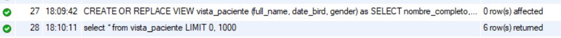
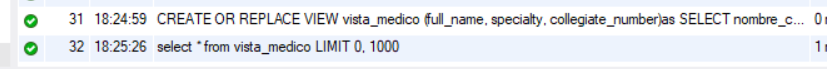
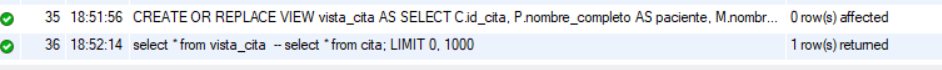

* Modificacion de vistas

```sql
CREATE OR REPLACE VIEW vista_paciente (id, full_name, date_bird, gender) AS 
SELECT id_paciente, nombre_completo, fecha_nacimiento, genero FROM paciente;

CREATE OR REPLACE VIEW vista_medico (full_name, specialty, collegiate_number) AS
SELECT nombre_completo, especialidad, num_colgeiado FROM medico;
```

* Actualización de tablas utilizando vistas

```sql
UPDATE vista_paciente
SET fecha_nacimiento = '1982-05-14'
WHERE id = 2
```
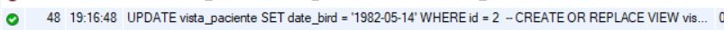

* Eliminación de vistas

```sql
DROP VIEW IF EXISTS
  vista_paciente;
```  
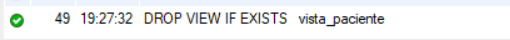

* Vistas vs Tablas Temporales (Investigacion)

Una VIEW no almacena datos y es tratada como consultas guardadas que se puede usar mientras uno no las elimine por lo que se parece mucho a un select que podemos ejecutar cuando sea necesario.

En el caso de las tablas temporales estas se crean como si fuese una tabla normal pero solo que como su nombre lo dice son temporales que una vez que se cierra sesion estas se eliminan junto con los datos que se almacena por lo que se puede realizar insert, update, y delete de datos .


#
### Ejercicio 2 - Procedimientos almacenados

* Creación de procedimientos almacenados para mostrar datos de una tabla.
 Utilizar parámetros para filtrar los datos a mostrar

```sql
 DELIMITER //
 
 CREATE PROCEDURE mostrar_paciente(IN nombreValue VARCHAR(200))
  BEGIN
   SELECT * FROM paciente
   WHERE nombre_completo = nombreValue;
  END//

DELIMITER ;

CALL mostrar_paciente('Amara J. Thorne')

```
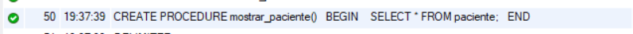

Al ejecutar el procedimiento

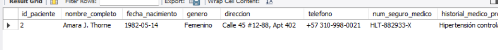


* Creación de procedimientos almacenados para insertar datos en una tabla 
 Utilizar condicionales para insertar datos

```sql
DELIMITER //
 
 CREATE PROCEDURE insertar_paciente(
    IN nombreValues VARCHAR(200),
    IN fecha_nacimientoValues DATE,
    IN generoValues VARCHAR(20),
    IN direccionValues VARCHAR(255),
    IN telefonoValues VARCHAR(20),
    IN num_seguro_medicoValues VARCHAR(50)
 )
BEGIN
   IF nombreValues IS NOT NULL THEN
    INSERT INTO paciente(nombre_completo, fecha_nacimiento, genero, direccion, telefono,    num_seguro_medico)
    VALUES (nombreValues, fecha_nacimientoValues, generoValues, direccionValues, telefonoValues, num_seguro_medicoValues);
   END IF;
END//

DELIMITER ;

CALL insertar_paciente(
   'Carlos Andrés López',
   '1990-08-15',
   'Masculino',
   'Calle 23 #45-67',
   '3001234567',
   'SM-987654'
);

```

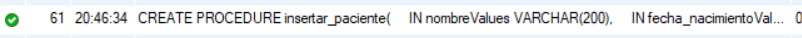

Hacer uso del procedimiento.

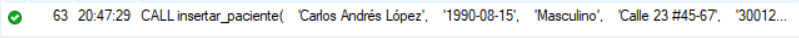


* Creación de procedimientos almacenados para actualizar datos en una tabla

```sql

DELIMITER //
 
 CREATE PROCEDURE actualiza_paciente(
    IN idValues INT,
    IN telefonoValues VARCHAR(20)

 )
BEGIN
  IF telefonoValues IS NOT NULl THEN
    UPDATE paciente
    SET telefono = telefonoValues
    WHERE id_paciente = idValues;
  END IF;  
END//

CALL actualiza_paciente(2, '234-234-232')

DELIMITER ;
```
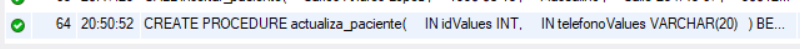

Al usar el procedimiento,

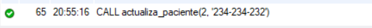

* Manejo de excepciones en procedimientos almacenados (Investigacion)

Funciona como un TRY CATCH que se usa para cuando el codigo SQL que queremos ejecutar en caso de que ocurra un error en el bloque anterior permita tomar desiciones apartir de ello usando ROLLBAKS. teniendo en cuenta que en cada gestor de base de datos su estructura es diferenete en 
(SQLServer es BEGIN TRY  BEGIN CATCH) en MySql se utiliza (HANDLERS).


* Procedimientos Almacenados vs Funciones  (Investigacion)

PROCEDURE se le considera un script  de la base de datos que estab diseñados para ejecutar acciones que modifican los estados de los datos ademas que tiene parametros de entrada y salidad y esto hace que al ser usado pueda devolver multiples valores y tambien tiene en cuenta el manejo de errore y transacciones

Funciones 

Se usa directamente en el SELECT ya que se usa para calculos rapidos 


#
### Ejercicio 3 -  Triggers

* Creación de triggers
1. Registro de cambios en tablas (INSERT, UPDATE, DELETE)

```sql
DELIMITER //

-- INSERT

CREATE TRIGGER insert_paciente
AFTER INSERT ON Paciente
FOR EACH ROW
BEGIN
    INSERT INTO historial_paciente( 
       fecha_creacion,
       notas_medico,
       diagnosticos,
       id_paciente
    )
    VALUES (NOW(), CONCAT('Paciente agregado',NEW.nombre_completo ), 'N', NEW.id_paciente)
END //

DELIMITER  ;

```

```sql
-- UPDATE

DELIMITER //

CREATE TRIGGER update_paciente
AFTER UPDATE ON paciente
FOR EACH ROW
BEGIN
    INSERT INTO historial_paciente(
        fecha_creacion,
        notas_medico,
        diagnosticos,
        id_paciente
    )
    VALUES(
        NOW(),
        CONCAT('Paciente actualizado: ', NEW.nombre_completo),
        'Cambio de datos',
        NEW.id_paciente
    );
END//

DELIMITER ;
```

```sql
--DELETE

DELIMITER //

CREATE PROCEDURE eliminar_paciente(IN idValue INT)
BEGIN
    DELETE FROM paciente
    WHERE id_paciente = idValue;
END//

DELIMITER ;
```

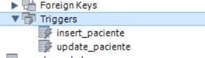

2. Validación de datos antes de permitir operaciones


3. Utilizar los triggers para el registro de historial


Conclusión

Se aprendio a ejecutar VIEW en mysql y como funciona tambien se aprendio a usar lo PROSEDURES  y a como llamar. tambien se implemto un crud de TRIGGERS que funciona como disparadores antes de que se realize una accion a una tabla en especifico. Y tambien vi más la diferencia que existe entre una VIEW vs TABLAS TEMPORALES el lab lo realize usando Workbrench.


Fuentes

* <https://dev.mysql.com/doc/>

* <https://www.w3schools.com/mysql/mysql_view.asp>

* <https://learn.microsoft.com/es-es/sql/relational-databases/tables/temporal-tables?view=sql-server-ver17>

* https://learn.microsoft.com/es-es/sql/t-sql/language-elements/try-catch-transact-sql?view=sql-server-ver17


